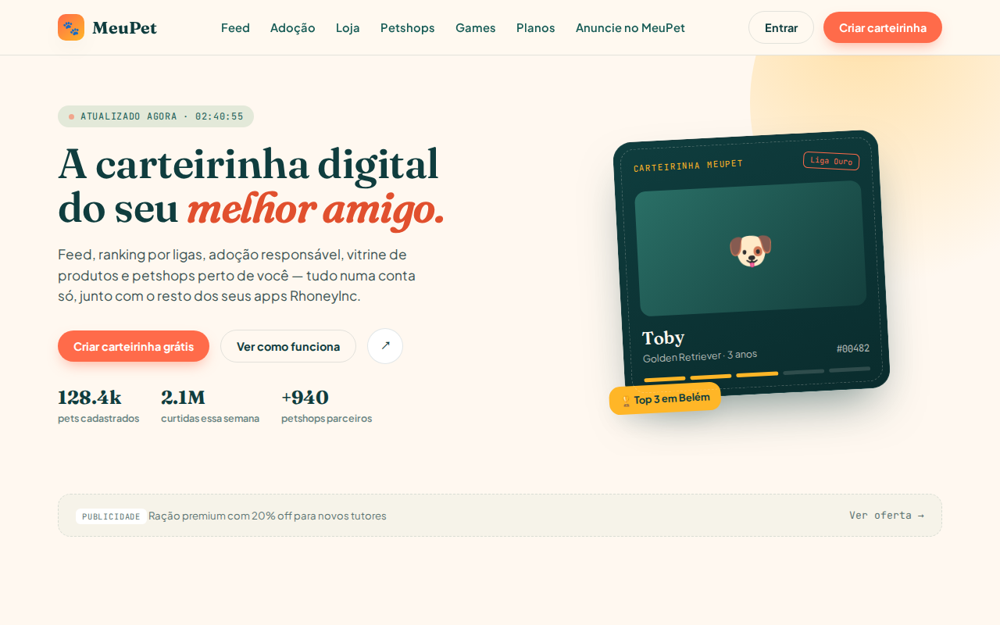
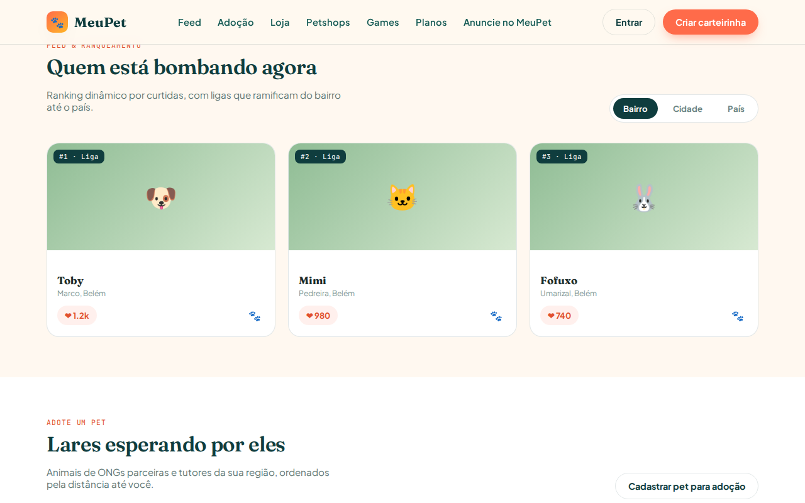
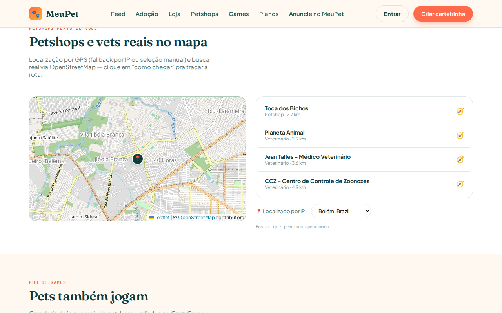

# MeuPet 🐾

**A carteirinha digital do seu melhor amigo.**

Feed com ranking por ligas, adoção responsável, vitrine de produtos, petshops reais perto de você, hub de jogos e um programa de parceiros/patrocinadores — tudo num app só, feito pela RhoneyInc.



---

## Índice

- [Visão geral](#visão-geral)
- [Funcionalidades](#funcionalidades)
- [Stack técnica](#stack-técnica)
- [Estrutura do projeto](#estrutura-do-projeto)
- [Rodando localmente](#rodando-localmente)
- [Configurando o Supabase](#configurando-o-supabase)
- [Schema do banco](#schema-do-banco)
- [Segurança](#segurança)
- [Monetização](#monetização)
- [PWA](#pwa)
- [Deploy](#deploy)
- [Roadmap / limitações conhecidas](#roadmap--limitações-conhecidas)
- [Licença](#licença)

---

## Visão geral

MeuPet é um PWA (Progressive Web App) de página única — sem build step, sem framework — que funciona **100% com dados de demonstração fora da caixa** e liga automaticamente a um banco real assim que um projeto [Supabase](https://supabase.com) é configurado. Nenhuma função quebra sem banco: é só um jeito de testar/demonstrar o produto antes de conectar dados de verdade.

Dois arquivos idênticos servem a mesma aplicação — `index.html` (usado pelo deploy) e `meupet.html` (mantido em sincronia, referenciado no `SETUP.md` e no fluxo de configuração do Supabase).

<p align="center">
  
  
</p>

## Funcionalidades

| Área | O que faz |
|---|---|
| **Feed & Ranking** | Ranking dinâmico de pets por curtidas, com escopo Bairro/Cidade/País e atualização em tempo real via Supabase Realtime. Cada pet tem botão de compartilhar (🐾) com Web Share API nativa + fallback para WhatsApp/Facebook/Instagram/X. |
| **Adoção** | Listagem de pets para adoção com filtro por espécie (Cães/Gatos/Outros), favoritos e ordenação por distância real (Haversine) a partir da localização do usuário. |
| **Loja (Vitrine)** | Produtos com link de afiliado real (`rel="sponsored"`), produtos patrocinados em destaque, e CTA dinâmico pra "loja física mais próxima" (reaproveita a busca de petshops). |
| **Petshops perto de você** | Mapa real (Leaflet + tiles do OpenStreetMap, sem chave de API), busca de petshops/veterinários reais via **Overpass API** quando não há parceiros cadastrados, e botão "como chegar" com rota real (Google Maps). Petshops parceiros pagos ganham pin dourado 🏅 e prioridade. |
| **Games** | Hub com jogos reais e bem avaliados (curadoria manual, com nota e nº de avaliações reais do CrazyGames), abrindo em nova aba. |
| **Planos** | Free e Premium para tutores (carteirinha, boost no ranking, sem anúncios). |
| **MeuPet Business** | Área de patrocínio/parceria com 3 planos (Básico, Destaque, Banner patrocinado) e formulário de cadastro — gera um *lead*, nunca ativa o parceiro sozinho (ativação real é sempre manual, depois do pagamento combinado). |
| **Compartilhamento** | Botão de compartilhar o app inteiro (Hero) e cada pet do feed — Web Share API no celular, menu próprio no desktop. |
| **PWA** | Instalável, funciona offline (cache first pros assets, network first pro HTML e sempre-network pras APIs), com push notification já preparado no service worker. |

## Stack técnica

- **Front-end:** HTML + CSS + JavaScript puro, sem build step nem framework.
- **Banco/Auth/Storage:** [Supabase](https://supabase.com) (Postgres + Row Level Security + Auth + Storage), via `@supabase/supabase-js` (CDN).
- **Mapa:** [Leaflet](https://leafletjs.com) + tiles do [OpenStreetMap](https://www.openstreetmap.org) — sem chave de API.
- **Descoberta de petshops:** [Overpass API](https://overpass-api.de) (OpenStreetMap) — gratuita, sem chave.
- **Geolocalização:** GPS do navegador → reverse geocode ([bigdatacloud.net](https://www.bigdatacloud.net)) → fallback por IP ([ipapi.co](https://ipapi.co)) → seleção manual.
- **PWA:** service worker próprio (`sw.js`), sem Workbox.
- **Deploy:** [Vercel](https://vercel.com) (site estático).

## Estrutura do projeto

```
MeuPet/
├── index.html            # app completo (HTML+CSS+JS) — versão em produção
├── meupet.html            # cópia idêntica, mantida em sync a cada mudança
├── meupet_schema.sql      # schema completo do Supabase (tabelas, RLS, triggers, seeds)
├── sw.js                  # service worker do PWA
├── manifest.json          # manifest do PWA
├── privacidade.html        # política de privacidade (LGPD)
├── icons/                 # ícones do app e feature graphic
├── docs/                  # screenshots usados neste README
├── SETUP.md               # passo a passo de configuração do Supabase
├── vercel.json            # config de deploy
└── .gitignore
```

## Rodando localmente

Não precisa de build nem de instalar dependências — é um site estático:

```bash
cd MeuPet
python3 -m http.server 8080
# abra http://localhost:8080/index.html
```

Sem `SUPABASE_URL`/`SUPABASE_ANON_KEY` configurados, o app roda inteiro com dados de demonstração (feed, adoção, vitrine, petshops) — nada quebra.

## Configurando o Supabase

Passo a passo completo em **[SETUP.md](SETUP.md)**. Resumo:

1. Criar projeto em [supabase.com](https://supabase.com).
2. Rodar `meupet_schema.sql` inteiro no SQL Editor.
3. Ativar os provedores de login **Google** e **Facebook** (o botão "Instagram" usa o provider Facebook por baixo — Instagram não tem OAuth próprio no Supabase).
4. Copiar a **Project URL** e a **anon public key** para dentro de `index.html`/`meupet.html`:
   ```js
   const SUPABASE_URL = "";
   const SUPABASE_ANON_KEY = "";
   ```
5. (Opcional) Configurar `SPONSOR_CONTACT_EMAIL` no mesmo arquivo, pro formulário do MeuPet Business ter um canal de e-mail de fallback.

## Schema do banco

15 tabelas, todas com Row Level Security habilitado:

| Tabela | Papel |
|---|---|
| `profiles` | Perfil do tutor (nome, avatar, cidade, plano) |
| `pets` | Carteirinha digital do pet |
| `posts` | Posts do feed |
| `likes` | Curtidas — recalcula `pets.rank_score` via trigger |
| `adoption_listings` | Anúncios de adoção |
| `petshops` | Petshops/veterinários (parceiros e não-parceiros) |
| `products` | Vitrine de produtos (afiliados) |
| `games` | Hub de jogos |
| `plans` / `subscriptions` | Planos e assinaturas |
| `sponsors` | Banners de patrocínio dinâmicos |
| `ad_impressions` | Telemetria de impressão/clique (anúncios e afiliados) |
| `partner_leads` | Cadastros do MeuPet Business (leads comerciais) |
| `reports` | Moderação/denúncias |
| `admins` | Lista de administradores (`is_admin()` security definer) |

Função destacada: `petshops_near(lat, lng, raio_km)` — busca por geolocalização real usando `cube`/`earthdistance`.

## Segurança

Todo dado vindo do banco (nome de pet, cidade, produto, patrocinador...) passa por uma função `esc()` antes de entrar no DOM — sem exceções — para prevenir XSS armazenado, já que várias dessas tabelas aceitam escrita do próprio usuário.

Pontos de RLS que valem destaque:
- **Auto-promoção bloqueada:** um trigger (`protect_partner_columns`) impede que um dono comum de petshop se autodeclare "Parceiro" (`is_partner`) sem passar pelo funil comercial — só admin pode setar essa coluna.
- **Sem auto-promoção a admin:** `is_admin()` é `security definer` e a tabela `admins` só tem policy de leitura.
- **Telemetria sem forjar identidade:** inserts públicos em `ad_impressions`/`partner_leads` (sem exigir login) são permitidos, mas o `user_id`/`created_by` só pode ser nulo ou o do próprio usuário autenticado.
- **URLs de saída validadas:** `sponsors.target_url` e `products.affiliate_url` só são aceitos como `http(s)` antes de virar um link clicável.

O desenvolvimento deste projeto usa um agente de revisão de segurança dedicado (`meupet-security`, parte do workspace de desenvolvimento — não incluso neste repositório) que já encontrou e ajudou a corrigir, entre outros: uma referência de chave estrangeira quebrada no sistema de curtidas, uma brecha de auto-promoção a parceiro, e lacunas de XSS em dados dinâmicos.

## Monetização

- **Afiliados:** produtos com `affiliate_url` real viram links clicáveis (`rel="sponsored noopener nofollow"`), com clique rastreado em `ad_impressions`.
- **Banners:** tabela `sponsors` alimenta os slots de anúncio do app — sem patrocinador ativo, cai num CTA interno honesto (nunca um link morto).
- **Petshop Parceiro:** planos Básico/Destaque com pin destacado no mapa e prioridade na busca.
- **MeuPet Business:** formulário de cadastro gera um lead comercial; cobrança e ativação são manuais (Pix/boleto) até haver volume que justifique um gateway de pagamento automatizado.

## PWA

- `manifest.json` com ícones, `share_target` e tema.
- `sw.js`: cache-first pros assets estáticos, network-first pro HTML, sempre-network pras chamadas a Supabase/Overpass/geolocalização (dados sensíveis/dinâmicos nunca ficam em cache).
- Instalável em Android/iOS/desktop direto do navegador.

## Deploy

Configurado para [Vercel](https://vercel.com) (`vercel.json`, `outputDirectory: "."`) — basta conectar o repositório.

Existe também um wrapper Android (TWA) já com build assinado, mantido fora deste repositório, pronto pra publicação na Google Play assim que a conta de desenvolvedor estiver ativa.

## Roadmap / limitações conhecidas

- O ranking por **Bairro** ainda cai no mesmo escopo do ranking geral quando conectado ao banco (falta um filtro por raio).
- Cobrança do MeuPet Business é manual — sem gateway de pagamento (Stripe/Mercado Pago) integrado ainda.
- O tile server público do OpenStreetMap tem política de uso pensada pra baixo/médio tráfego; em escala, migrar pra um provedor pago (MapTiler, Stadia Maps) ou self-host.
- Sem motor de dicas por IA (decisão consciente: por ora, prioriza zero custo/zero dependência de LLM externo).
- O `share_target` declarado no `manifest.json` ainda não tem uma rota `/share` implementada — instalar o PWA e tentar "compartilhar para o MeuPet" a partir de outro app não funciona ainda.

## Licença

Todos os direitos reservados — © 2026 MeuPet, um produto RhoneyInc.
